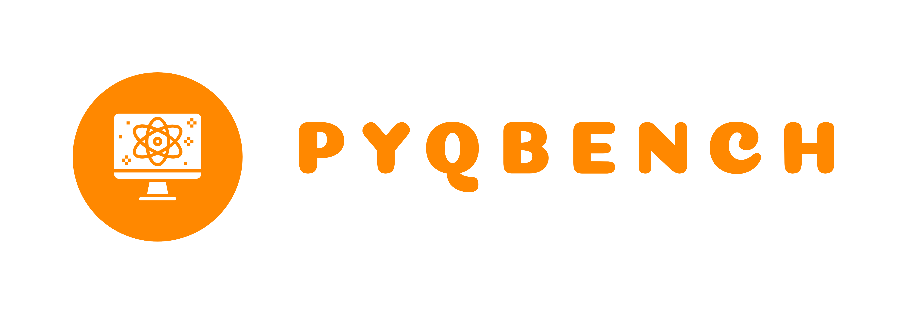

<div class="summary">
<p>
PyQBench is a package for benchmarking gate-based quantum computers by estimating how well they can discriminate between certain measurements.
</p>
</div>


::::{grid} 1 1 2 2
:gutter: 2

:::{grid-item-card}
{fas}`circle-down` [Installation](section/installation)
^^^
Get started with PyQBench by installing it via one of the available channels.
:::
:::{grid-item-card}
{fas}`book-open` [User guide](section/tutorial)
^^^
Learn how to use PyQBench in our step-by-step tutorials.
:::
:::{grid-item-card}
{fas}`magnifying-glass` [Reference manual](section/manual)
^^^
Looking for advanced usage or want to contribute to PyQBench? Check out 
detailed documentation of each class and function.
:::
:::{grid-item-card}
{fas}`wrench` [How it works](section/math)
^^^
Interested in maths behind PyQBench? Check this in-depth guide.
::::

```{toctree}
:hidden:
:maxdepth: 2

installing
tutorial
mathematical_foundations
reference/index
citing
faq
```
**Date**: {{date}} **Version**: {{version}}